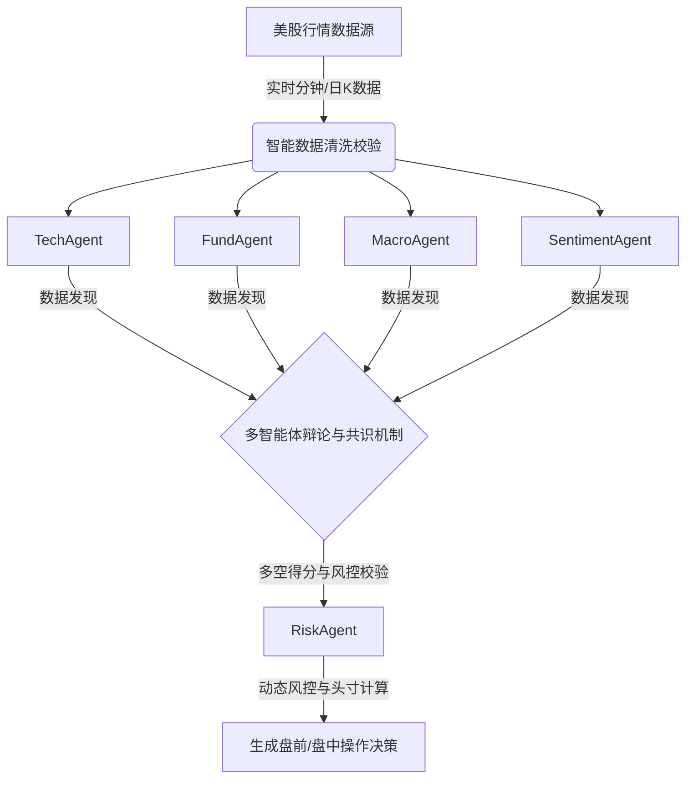

# 🌌 RynStock: 多智能体协同美股量化交易与盘中决策系统

[](https://www.python.org/)
[](LICENSE)
[]()

`RynStock` 是一个专为美股盘前计划、盘中盯盘、动态多空决策与每日交易 SOP 引导而设计的**高并发多智能体协同量化辅助系统**。系统通过对大师投资哲学（利弗莫尔、巴菲特、索罗斯等）的数字化建模，结合现代技术指标与宏观环境校验，为量化交易者提供兼具广度与深度的动态决策大屏。

---

## 🚀 核心架构与技术亮点

### 1. 🤖 多智能体协同共识网络 (Multi-Agent Consensus)
系统内置由 7 个专业领域智能体组成的分工共识网络，实现“大师圆桌辩论”式的分析产出：
*   **TechAgent (技术面智能体)**：基于多周期均线系统、RSI 极值及波幅变化生成买卖强度。
*   **FundAgent (基本面智能体)**：跟踪 P/E、P/S 估值百分位、财报营收及行业壁垒。
*   **MacroAgent (宏观面智能体)**：校验美联储政策利率、纳指/标普板块强弱及指数偏离。
*   **SentimentAgent (情绪面智能体)**：扫描社交媒体热度与分析师评级共识。
*   **CommunityAgent (社区声音智能体)**：挖掘 Reddit/WSB 等高波动社区意见。
*   **RiskAgent (风险守卫智能体)**：基于个股 beta 波动与破位条件计算动态止损与风控边界。
*   **StrategyAgent (策略统筹智能体)**：主持多轮论证，整合多方意见，达成最终多空得分。



### 2. 🎛️ 拟物化玻璃态动态大屏 (Glassmorphism Dashboard)
*   **黑金玻璃拟物设计**：采用 HSL 精细配色与磨砂玻璃态布局，营造极具科技感与和谐视觉的交易台终端。
*   **SOP 标准作业引导**：按照交易时钟，动态提示盘前计划、盘中盯盘、盘后总结的完成状态，杜绝感性交易。
*   **SVG 极简烛台卡片**：使用极低渲染消耗的轻量化内联 SVG 图表，在纯本地无依赖大屏幕上渲染每秒更新的分钟走势。
*   **高并发日志推送终端**：在网页端内嵌流畅微动画的 console，实时滚屏推送各智能体的讨论日志。

### 3. 📂 个人全知型交易知识库 (Syncing Knowledge System)
*   构建基于 `knowledge_agent` 的系统运行知识索引，每次运行均会自动对决策逻辑、CIO 偏好和大师偏好进行同步索引与归档。
*   支持从历史快照中一键恢复或追溯任何一个历史交易日的智能体立场（Stances）与多空辩论演变轨迹。

---

## 🛠️ 快速启动指南

### 1. 克隆与环境配置
```bash
git clone https://github.com/liranwang828-ctrl/ryn_stock.git
cd ryn_stock
pip install -r requirements.txt
```

### 2. 配置密钥环境变量
复制模板生成您的私密配置文件（已被 Git 自动忽略）：
```bash
cp .env.template .env
# 编辑 .env 文件，填写您的 LLM (如 DeepSeek/OpenAI/Gemini) 密钥
```

### 3. 启动量化看板
```bash
# 启动多线程高性能数据同步大屏
python agents/dashboard_server.py
```
在浏览器中打开 `http://localhost:8000` 即可享受完整的拟物化智能终端。
