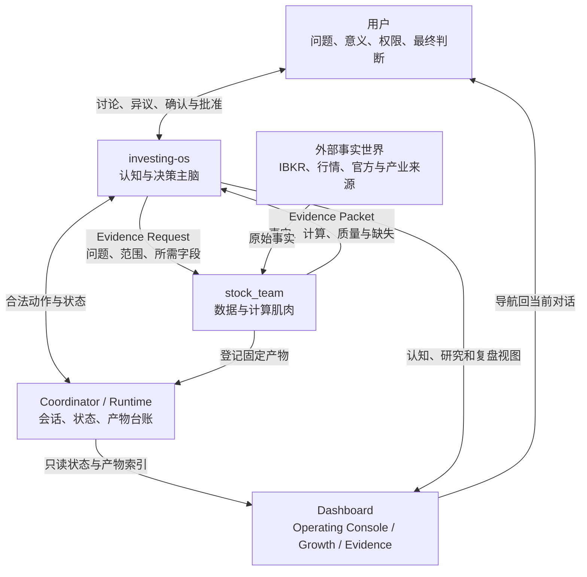
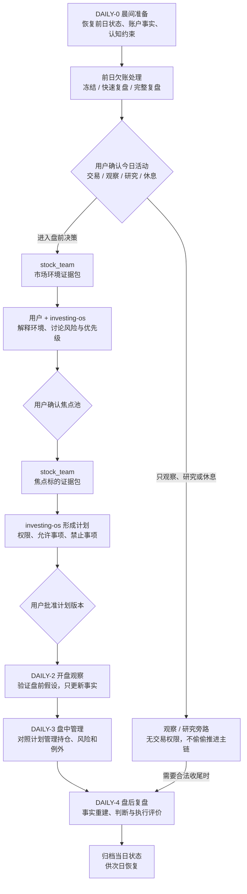
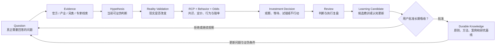
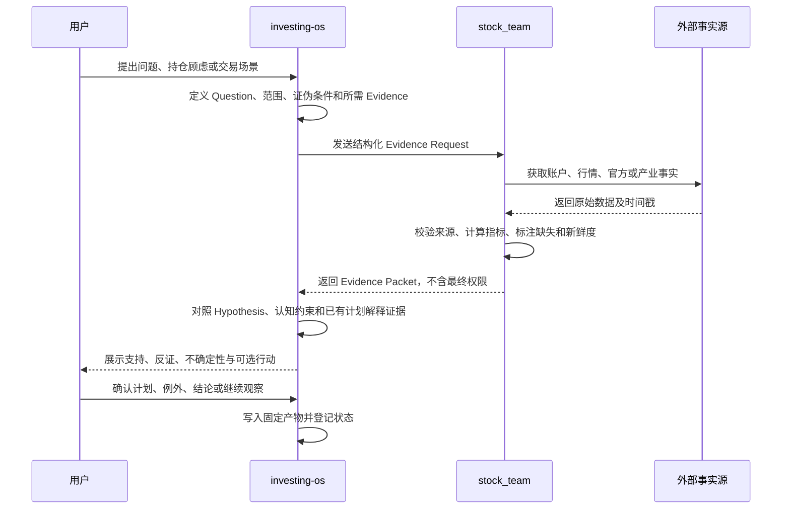
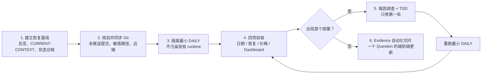

# Investing-OS / Stock Team 系统总览与当前状态

状态：2026 年 8 月恢复基线
最近事实核验：2026-08-13
适用对象：用户、高阶模型、受控执行局部任务的协作者

## 1. 十分钟摘要

这不是一套自动交易机器人，也不是若干脚本和 Dashboard 的集合。它是一个由用户主导的个人投资操作系统：

```text
个人认知 × AI 研究放大器 × 数据与纪律执行系统
```

系统已经拥有相当丰富的旧资产、DAILY 状态机、盘前和盘中工具、Dashboard、研究框架、公司阅读报告以及认知沉淀机制。2026 年 7 月曾完成多轮测试和真实试跑，但截至 2026-08-13 尚未重新验证完整的最小 DAILY。因此当前最准确的描述是：

- 架构与工作流边界已经形成；
- DAILY 有可试跑原型和较广历史测试覆盖，但整体仍是 `partial`；
- Operating Console 和认知 Dashboard 已有可复用成品级资产；
- Research Database V3 Alpha 已有模板、三大研究问题、Dashboard 摘要和公司阅读报告原型；
- 高质量 Evidence 的自动生产、验证和持续更新尚未闭环；
- 当前首要任务是恢复和验证已有链路，不是继续增加静态报告或重新开发一套系统。

项目边界与统一术语以[项目行动纲领](PROJECT-CHARTER.zh.md)为准，DAILY 细节以[DAILY 契约](system/workflows/DAILY-CONTRACT.zh.md)为准，细粒度实现状态以[工作流状态台账](system/workflows/WORKFLOW-STATUS.zh.md)为准。

## 2. 一个产品，两个内核

| 主体 | 核心职责 | 明确不负责 |
|---|---|---|
| 用户 | 提出问题、解释意义、确认权限和计划、作出最终判断、批准经验沉淀 | 不需要手工承担数据整理和流程追踪 |
| `investing-os` | 认知、研究问题、Hypothesis、决策边界、计划、复盘、经验与知识谱系 | 不冒充市场、账户和成交事实来源 |
| `stock_team` | 市场与账户事实、数据获取、指标计算、Evidence Packet、监控和事实报告 | 不替用户交易，不自行修改长期认知或授予权限 |
| Dashboard | 展示状态、缺失项、产物、研究和下一步导航 | 不成为第二套状态机，不自行生成交易结论 |

### 总体架构



核心原则是“脑—肌分工”：`investing-os` 决定为什么研究、如何解释、何时需要用户确认；`stock_team` 负责事实是否存在、数据质量如何以及计算结果是什么。

## 3. 系统工作流目录

系统统一使用“工作流 → 步骤 → 产物”，不再把 Node、Evidence Stage 和实施 Phase 混作每日步骤名称。

| 工作流 | 目的 | 当前优先级 |
|---|---|---|
| `DAILY` | 从晨间准备到盘后复盘的每日交易与观察节奏 | 当前 P0 |
| `RESEARCH` | 公司、行业、主题、宏观与事件研究 | DAILY 稳定后接 Evidence 自动化 |
| `REVIEW` | 周、月、季度、组合、论点和战术复盘 | 保留已有资产，尚未统一验收 |
| `LEARNING` | 教训审核、规则晋升、案例和认知更新 | 只允许用户批准后进入长期系统 |
| `VALIDATION` | 回测、历史类比、因子和战术验证 | 有能力资产，闭环未核验 |
| `SYSTEM` | 数据、契约、运行时和知识库维护 | 多项能力存在，统一入口未验收 |

## 4. DAILY 每日交易主链

DAILY 的目标不是要求每天交易，而是让每天都能合法开始、观察、跳过、恢复和结束。



### DAILY 的用户交互点

用户不是只在最后点击“批准”。真正需要用户参与的地方包括：

1. `DAILY-0`：确认今天的活动类型、账户事实是否可信、前日欠账如何处理；
2. `DAILY-1`：解释市场环境，确认焦点池，讨论风险和权限，批准计划；
3. `DAILY-2/3`：提出盘中观察、确认计划外例外，决定继续观察还是行动；
4. `DAILY-4`：补充主观事实，区分判断和执行问题，决定哪些经验值得进入候选；
5. `LEARNING`：只有用户能批准候选经验进入长期原则或认知。

### DAILY 固定产物

| 产物 | 主要生产者 | 用途 |
|---|---|---|
| 账户与持仓事实 | `stock_team` / IBKR | 确认真实风险暴露；缓存不能冒充正式来源 |
| 市场环境证据包 | `stock_team` | 回答今天整体环境是什么 |
| 焦点标的证据包 | `stock_team` | 只覆盖用户已确认焦点池 |
| 当日计划与权限 | `investing-os` + 用户批准 | 明确允许、禁止和需要重新确认的动作 |
| 盘中事实与观察事件 | `stock_team` + 用户对话 | 对照计划验证，不自动重写盘前证据 |
| 交易复盘证据包 | `stock_team` | 重建成交、持仓、价格和执行事实 |
| 复盘与经验候选 | `investing-os` + 用户 | 候选不能自动晋升为长期规则 |

## 5. Research Database 与认知成长闭环

Investing-OS 已从“记录更多知识”转向“持续维护可证伪的研究问题”。正式研究顺序是：



这条链禁止以下捷径：

- 新闻 → 观点 → 买卖；
- 价格上涨 → Reality 变强；
- 价格下跌 → 赔率必然改善；
- 社区或专家观点 → 直接写入 Reality；
- 一次复盘草稿 → 自动晋升为长期原则。

### V3 Alpha 当前三大问题

来源：[V3 Alpha Questions Ledger](handoff/2026-07-17-v3-alpha-questions-ledger.zh.md)

1. AI 利润最终沉淀在哪里？
2. Hyperscaler CapEx 是否真正开始放缓？
3. Inference 是否会创造第二轮 Hardware Demand？

DAILY 主报告应挂接一至三个当前问题。公司只是问题下的 Evidence，不再是每次研究的孤立起点。

### Evidence 分层

| 层级 | 典型来源 | 在系统中的用途 |
|---|---|---|
| Official Evidence | 财报、电话会、Investor Day、SEC、官方公告 | 建立 Reality，最高权重 |
| Industry Evidence | HBM、GPU、CoWoS、CapEx、Power、Networking 数据 | 验证产业 Reality |
| Alternative Evidence | Lead Time、租赁价格、招聘、电力审批、出租率 | 尝试领先发现 Reality |
| Expert View | 产业专家、X、Reddit、GitHub、开发者反馈 | 生成 Hypothesis，不直接成为 Reality |

## 6. 脑—肌握手：交易与研究共用的边界



`stock_team` 可以说“数据缺失”“价格位于 VWAP 下方”“IBKR 持仓为多少”；不能说“因此允许买入”。`investing-os` 可以组织行动选择和风险边界；不能用模型猜测代替盘前或账户事实。

## 7. Dashboard 地图

| 界面 | 当前定位 | 当前资产 | 不能承担的职责 |
|---|---|---|---|
| Operating Console | DAILY 首页与状态导航 | `#today / #evidence / #review / #diagnostics` 四个分页，读取 daily status 与 coordinator summary | 不自行 Init/Confirm/Start，不成为交易决策引擎 |
| Growth Dashboard | 独立认知系统界面 | 认知、原则、经验谱系、当前研究与成长数据 | 不推进 DAILY 状态，不替代盘中工作台 |
| Evidence / Report 页面 | 事实包与公司研究阅读界面 | AMAT、MU、NBIS、TSM、NOW、NVDA 等阅读报告和关键价格说明 | 页面能打开不代表数据新鲜或研究已验证 |
| Dashboard Server | API、静态页面和状态投影的现有接线点 | coordinator summary、daily status、research database bundle、价格刷新 | 不应持续吸收更多核心业务判断 |

Dashboard 与对话的分工是：

- Dashboard 回答“现在在哪一步、什么存在、缺什么、去哪看”；
- 对话回答“这些事实意味着什么、是否同意、下一步是否获准”；
- 固定文件回答“这次讨论最后确认了什么”；
- Coordinator 回答“当前允许执行哪个状态动作”。

## 8. 当前实现状态

以下“正式台账状态”沿用 2026-07-09 的[工作流状态台账](system/workflows/WORKFLOW-STATUS.zh.md)；“8 月判断”纳入后来本地提交和试跑资产，但在重新运行前不提升为 `verified`。

| 工作流 | 正式台账状态 | 后续已有资产 | 2026-08-13 判断 | 下一验收动作 |
|---|---|---|---|---|
| `DAILY` | `partial` | daily-status manifest、只读 Operating Console、yfinance 隔离试跑、交易日与价格相关修复 | 可进入隔离回归，未重新验证 | 跑最小 DAILY，验证日期、恢复、价格和页面一致性 |
| `RESEARCH` | `documented` | Research Database 模板、三大问题、Dashboard summary、公司/行业阅读报告 | 已有 `partial` 原型，但 Evidence 自动生产未闭环 | DAILY 稳定后选一个 Question 做端到端 Evidence 更新 |
| `REVIEW` | `documented` | DAILY-4 schema、full/quick/freeze、归档与部分复盘资产 | 统一周期复盘入口仍未验收 | 先随 DAILY-4 做一次真实收尾，再审周度入口 |
| `LEARNING` | `documented` | 候选原则、journal promotion、approval 资料和 Growth Dashboard | 有沉淀机制资产，自动/人工闭环未复验 | 用一次真实复盘候选验证批准与拒绝路径 |
| `VALIDATION` | `partial` | 回测、参数检验、历史类比与关键价格计算资产 | 能力丰富但与 Research/Decision 的连接未核验 | 选一个 Hypothesis 验证证据如何回写而不自动改规则 |
| `SYSTEM` | `partial` | schema、runtime、状态机、数据检查和文件标签台账 | 缺统一健康检查入口 | DAILY 回归中记录数据源、路径和状态一致性 |

### DAILY 分步状态

| 步骤 | 已有能力 | 当前不能宣称的内容 | 8 月重点 |
|---|---|---|---|
| `DAILY-0 晨间准备` | session type、跨日恢复候选、daily0 confirmation、旧会话选择逻辑 | 未重新证明历史会话不会阻塞今天；IBKR 正式事实链未复验 | 真实交易日期与跨日恢复 |
| `DAILY-1 盘前决策` | 市场/标的 Evidence 顺序、焦点池闸门、正式 snapshot 与 from-snapshot 路径、计划模板 | 不能用昨日收盘或低流动性指示价冒充盘前；完整真实握手未复验 | 数据时间戳、source kind、焦点确认和报告一致性 |
| `DAILY-2 开盘观察` | observation 状态、intraday snapshot、只读 Dashboard 投影 | 未证明当前实时价格链可靠；旧试跑曾发现非交易日仍标记 verified | 交易日校验、真实开盘价和 observation 合法动作 |
| `DAILY-3 盘中管理` | 快照、VWAP、关键位、例外记录、manifest 候选 | 单次刷新、循环、IBKR 和 Dashboard 仍可能是不同链 | 先验证一次刷新事实贯穿页面，不扩展循环功能 |
| `DAILY-4 盘后复盘` | full/quick/freeze 结构化 review、归档门和历史测试 | 尚未完成一次 8 月真实闭环；周期复盘和 Growth promotion 未复验 | 最小收尾、归档和次日可恢复 |

### 已知的关键风险

1. 数据真实性：历史上多次出现昨日收盘价被误读为盘前/实时价格；必须保留时间戳、市场时段和来源类型。
2. 交易日期：美股交易日要按交易所日历和纽约时区处理，不能使用北京时间自然日直接分会话。
3. 历史会话：旧会话、损坏会话和未复盘状态曾阻塞新日启动；恢复策略必须可解释并可测试。
4. 页面与事实脱节：Dashboard 能显示旧 session 或旧产物，存在不等于当日有效。
5. 认知膨胀：大量静态报告已经存在，下一阶段价值来自 Evidence 更新能力，而不是报告数量。
6. 超级入口继续变大：`dashboard_server.py` 已承担很多接线职责，修复时应限制范围，不顺手增加新的业务判断。

## 9. Git、运行时和数据现状

### Git

- 当前分支：`codex/repository-cleanup-20260630`；
- 远端：`origin` 已配置；
- 2026-08-13 恢复开始前，本地相对远端领先 55 个提交；
- 加入本总览的设计和实施计划后，推送前提交数会继续增加，最终以同步核验为准；
- 55 个既有本地提交主要包含 Research Database、Dashboard、公司报告、关键价格和少量行情/观察修复；
- 工作区仍有用户未提交的认知方法论、索引修改和一份运行时观察文件，本轮不得顺手提交或清理。

### 运行时

- `investing-os/system/runtime/` 保存会话、输入、packet、决策和运行状态；
- 运行时账户、成交和观察文件默认保持本地，不作为源代码提交；
- 正式文档、schema、模板和 `.gitkeep` 等结构文件可进入 Git，但不能混入真实账户事实。

### 数据源优先级

| 场景 | 正式优先来源 | 降级使用 |
|---|---|---|
| 账户、持仓、成交 | IBKR | 缓存只读展示并标记 `stale_unverified` |
| 盘前/实时价格 | 带可验证时间戳和市场时段的正式 provider / IBKR | yfinance 可用于隔离观察，不能自动冒充正式事实 |
| 公司 Reality | 财报、电话会、SEC、官方材料 | 新闻用于发现和补充，不能替代官方事实 |
| 产业 Reality | 产业数据与上下游交叉验证 | 专家观点只用于生成 Hypothesis |

## 10. 2026 年 8 月恢复路线



### 最小 DAILY 回归的通过标准

只有下面四项都以同一次隔离运行的证据通过，才可以把 DAILY 从“历史可试跑”提升为“2026 年 8 月已重新运行”：

1. 交易日期：按纽约市场交易日选择正确 session，不受北京时间跨日干扰；
2. 会话恢复：旧归档日不阻塞今天，未完成或损坏状态按契约明确处理；
3. 价格真实性：盘前与实时价格有时间戳、来源和市场时段，昨日收盘不能伪装成当前价格；
4. Dashboard 展示：Operating Console 读取同一 session 和同一产物台账，缺失时显示缺失而不是“存在且有效”。

### Evidence 自动化的下一最小切片

DAILY 稳定后，不批量生成更多公司报告。选择一个 Alpha Question，例如“Hyperscaler CapEx 是否放缓”，完成：

```text
固定问题
→ 一份官方 Evidence Request
→ stock_team 获取并结构化一份新 Evidence
→ 更新对应 Hypothesis confidence 与 next validation
→ Dashboard 显示变化及来源
→ 用户确认是否进入长期研究基线
```

这才是从静态 Knowledge Base 走向 Research Operating System 的真正一步。

## 11. 文件导航

### 项目与工作流

- [项目行动纲领](PROJECT-CHARTER.zh.md)
- [DAILY 契约](system/workflows/DAILY-CONTRACT.zh.md)
- [工作流状态台账](system/workflows/WORKFLOW-STATUS.zh.md)
- [脑—肌握手协议](system/workflows/brain-muscle-handshake-protocol.md)
- [当前恢复上下文](handoff/CURRENT-CONTEXT.zh.md)

### Research Database 与认知系统

- [Evidence System 与 Research Infrastructure](handoff/2026-07-16-evidence-system-and-research-infrastructure.zh.md)
- [AI 利润迁移认知增量](handoff/2026-07-16-ai-profit-migration-knowledge-increment.zh.md)
- [V3 Alpha 阶段总结](handoff/2026-07-17-investing-os-v3-alpha-stage-summary.zh.md)
- [V3 Alpha Questions Ledger](handoff/2026-07-17-v3-alpha-questions-ledger.zh.md)
- [研究报告可靠性检查](system/checks/research-report-reliability-checklist.zh.md)

### Dashboard 与报告

- [Operating Console](dashboards/operating-console.html)
- [Growth Dashboard](dashboards/growth-dashboard-draft.html)
- [研究报告模板](dashboards/research-report-template.html)

## 12. 状态维护规则

1. 本文是低频更新的系统地图；`WORKFLOW-STATUS.zh.md` 是高频事实台账。
2. 架构、职责、工作流名称或整体成熟度变化时更新本文。
3. 单个测试、运行或步骤状态变化时先更新状态台账；影响整体判断时再同步本文。
4. 每次状态变化必须包含日期、证据、缺口、下一动作和 Git commit。
5. 历史测试通过不等于今天通过；页面能打开不等于事实有效；文件存在不等于流程完成。
6. 未进入 Git 的聊天结论不是项目事实；未获用户批准的候选经验不是长期认知。
