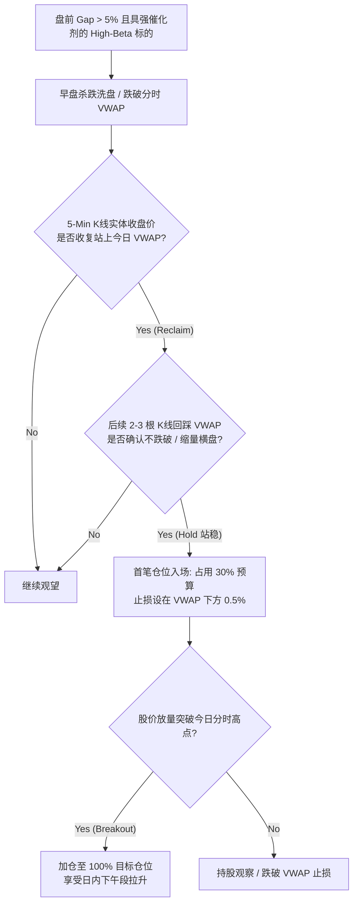

# 交易日记

date: 2026-05-28

## 盘前准备
- 大盘预判：高波动分化日，月末/周五卖盘风险作为顺风偏置存在，但不构成全盘去风险。
- 今日关注标的：BABA、SYM、FUTU、NVDA、VST、NOW；盘中机会观察 SNOW、NBIS、IOT。
- 关键价位：
  - BABA：124 失守后转弱，反抽 125.50-126.20 卖 30 股；弱拉锯不再拖延。
  - SYM：51.00-52.50 反弹逃生；47.00 硬止损清空。
  - NVDA：208 承接；VST：149 承接；NOW：104.50-106.00 回踩确认。
- 宏观背景：BTC 走弱，风险偏好降温；但盘中仍有高 beta 机会股轮动。

## 实际操作记录

### 操作 1
- 时间：盘中
- 标的：BABA
- 方向：卖出 / 减仓
- 价格：盘中执行，结果接近分钟级局部低点
- 仓位：卖出 30 股
- 入场理由（具体指标/信号）：跌破 124 后未能有效收复，VWAP 压制明显，属于应当去弱换强的低效率仓位
- 止损位置及理由：不是传统止损，而是弱仓资金释放纪律
- 目标价及理由：释放现金，用于更强主线或保留流动性
- 当时大盘状态：风险偏好偏弱，但未全面崩盘
- 当时板块状态：中概偏弱，无法提供修复共振

### 操作 2
- 时间：盘中
- 标的：SYM
- 方向：卖出 / 清退
- 价格：盘中执行，结果接近分钟级局部低点
- 仓位：清退
- 入场理由（具体指标/信号）：Stage 4 破位，论点短线失效，纪律上禁止加仓摊平
- 止损位置及理由：47 附近属于硬执行线
- 目标价及理由：释放认知负担与风险预算
- 当时大盘状态：大盘有波动，个股高 beta 情绪脆弱
- 当时板块状态：物理 AI 没有提供有效承接

## 盘中观察（随时更新）
- BABA 与 SYM 的方向判断都对，但实际卖点几乎都贴着分钟级低点，说明执行节奏被盘口恐慌牵着走。
- 这不是“卖错了方向”，而是“卖对了方向，但卖得太急、太受情绪驱动”。
- 需要区分两类场景：
  - 真正失控破位：可以立即执行
  - 破位后弱拉锯：应允许 3-10 分钟分歧过滤，或等一笔弱反抽挂单，不让市场替自己在最差价成交
- NBIS 今日并非“只有最后起飞那一刻才有机会”。真正可抓的结构出现在：
  - 10:50-10:52：重新收复 VWAP 并连续站稳，这是最标准的由弱转强确认点
  - 11:00-11:03：224.5 一带横住后再向上突破，这是次优机会
- 这说明今天另一类错失不是“没买在最低点”，而是没有在 `VWAP reclaim → 站稳 → 再扩张` 的过程中执行。

## 盘后问题（给复盘 agent 提问）
- 为什么 BABA / SYM 这种“该卖”的仓位，会连续卖在几乎最低点？是我过度放大了破位信号，还是低估了分钟级回抽概率？
- 应该如何把“方向正确的止损/减仓”升级为“方向正确且节奏更优的止损/减仓”？
- 对于弱仓清退，是否应该固定加入一个 3-10 分钟分歧过滤器，除非出现真正的失控砸穿？
- 如何区分“应该立刻砍”的失控走势，与“可以给一次弱反抽卖出机会”的弱拉锯走势？
- 对于 NBIS 这类高 beta 机会股，今后是否应把“VWAP 收复并站稳”明确定义为日内可执行信号，而不是等到加速后才觉得可惜？

## 盘后 Sandbox（2026-05-28）

### 一、今天的市场模板
- 今天不是纯防守日，而是“指数不崩、VIX 不继续恶化、强票回踩后容易走二段”的进攻型日子。
- 多只高 beta 机会股重复同一个结构：先回踩，再收复 VWAP，然后站稳扩张。
- 代表案例：SNOW、NBIS、ARM，某种程度上也包括 IOT。

### 二、今天做对了什么
- BABA / SYM 的大方向判断是对的：都属于该减、该清的弱仓。
- IOT 这笔日内交易抓到了有效结构：VWAP 回踩后快速反弹，并重新接近日高。
- 盘中逐渐识别出“回踩 -> reclaim VWAP -> 再扩张”是今天的主模板。

### 三、今天没做好的地方
- 对弱仓：卖得太急，心理被分钟级恐慌牵着走，卖在局部最低点附近。
- 对强票：确认得太慢，等到 SNOW / NBIS / ARM 已经明显走出来，才承认结构成立。
- 核心错位不是看错个股，而是市场已经切到偏进攻环境，主观心态还停留在防守模式。

### 四、统一 lesson
- 弱仓处理要分层：
  - 真失控破位：立即执行。
  - 破位后弱拉锯：允许 3-10 分钟过滤，或挂反抽单，不把最差价格让给市场。
- 强票处理要模板化：
  - 当 QQQ 稳、VIX 不恶化、个股 reclaim VWAP 并站稳 3-5 分钟，可以允许小仓试错。
  - 不再等“已经起飞很远”才承认它强。

### 五、IOT 的临时结论
- 今天的强势足以证明：IOT 不是“短线完全不能碰”的死票。
- 但这还不足以推翻原有中长期 thesis：per-device、AI 弹性弱、财报前不宜自然升级成长拿。
- 当前更适合把 IOT 定义为一次成功的日内/战术交易，而不是长期翻案。

### 六、明日可执行提醒
- 先判环境，再判个股：QQQ / VIX / 板块强弱优先级要前置，顺风出重手，逆风收拳头。
- 强票处理严格指标化：盘中强势股回踩后一旦 reclaim VWAP 并站稳 3-5 分钟，无需等待完美突破，直接小仓试错。
- 弱仓处理分流制：在砍仓或减仓瞬间，强制自问“这是 Waterfall 瀑布暴跌，还是无量弱拉锯？”

---

## 🎙️ 盘后大师联席会：2026-05-28 全量复盘与铁律沉淀

在 2026-05-28 交易日结束后，大师沙盒联席会成员重新集结。针对今日实盘交易中**“BABA 与 SYM 割肉在分钟级最低点”**的致命节奏痛点，以及**“NBIS / SNOW 强力日内反弹踏空”**的认知错位，展开了一场关于**战术执行精度与无摩擦交易**的巅峰辩论。

---

### ⚔️ 第一部分：大师沙盒激辩 —— 节奏的魔鬼与情绪的弹簧

#### 👨‍🦱 杰西·利弗莫尔 (Jesse Livermore) —— 趋势动量与盘口大作手派
> “我们必须对大方向的正确表示赞赏：减持 BABA 和清退 SYM 避开了 Stage 4 的泥石流，这是战略胜利。**但在战术执行上，今天的两笔割肉堪称盘口灾难！**
>
> 我们在 09:33 把 BABA 卖在了 `$124.20` 的局部最低点，又在 SYM 跌破 `$47` 的那一瞬间以市价仓皇逃生。这根本不是顶级交易员的冷酷执行，而是被分钟级别的数字跳动夺去了心智！
>
> 盘口的本质是情绪的弹簧。开盘 15 分钟内，像 BABA 这种具有重兵把守的 Put Wall（`$125.00`）股票，低开后空头必定会平仓锁利，从而引发脉冲式反抽。如果下跌没有伴随 **『大盘放量崩塌 + 个股连续巨量大阴线』** 的失控瀑布（Waterfall），就属于由情绪踩踏引发的 **『弱拉锯破位』**。在弱拉锯破位中，绝对不能急于用市价单（Market Order）清退，必须至少等待 3-10 分钟让做市商的对冲买盘缓冲，在反抽阻力位挂限价单出局！”

#### 👨‍🦳 霍华德·马克斯 (Howard Marks) —— 价值风险与第二层思维派
> “利弗莫尔说到了痛处。这正是『第一层思维』与『第二层思维』在执行端的割裂。
>
> * **第一层思维**看到：『天啊，BABA 跌破了 124 止损线，SYM 跌破了 47 硬止损，纪律大过天，快卖掉！』
> * **第二层思维**则会问：『价格为什么会在这里？开盘砸出的分钟级低点，恰恰是所有散户恐慌盘集中涌出、而机构在被动接盘并准备平仓空头的时间点。此时的风险收益比已经极度扭曲，回抽的概率远大于继续暴跌的概率。』
>
> 我们在盘前沙盒计划中明确写道：**“09:30-09:45 是情绪回补观察期，反弹至 125.50-126.20 卖出”**。但当开盘红绿闪烁在屏幕上时，我们直接推翻了计划，任由心理防线被恐慌接管。这种『盲目砍仓』，其实是穿了纪律外衣的心理 capitulation。”

#### 🧔 乔治·索罗斯 (George Soros) —— 反身性与反馈回路派
> “这正是反身性（Reflexivity）在极短周期内的经典体现。当股价急剧下跌时，交易软件上的负反馈（浮亏数字的跳动）瞬间扭曲了我们对真实价值和流动性的认知。
>
> 市场在开盘时，正是利用了这种短期的不对称性，制造了分钟级别的流动性黑洞。我们以市价单（Market Order）清退，等同于在这个黑洞中主动向做市商『进贡』溢价。
>
> 为了彻底解决这个问题，我们必须在算法和指令上进行解耦。除非盘面被判定为 **『Systemic Freefall』（系统性崩塌）**，否则对于弱仓的清退，我们必须强制引入 **『3-10分钟分歧过滤器』**。这几分钟是让反射性回环从非理性杀跌中冷静下来的黄金窗口。”

#### 👴 斯坦利·德鲁肯米勒 (Stanley Druckenmiller) —— 资金效率与战术分流派
> “很好！今天唯一的亮色是我们做多 IOT 的日内交易抓到了主模板，且割肉释放的现金在后半夜的流动性管理中发挥了重要作用。但这依然掩盖不了我们在 NBIS / SNOW 上的拖延。
>
> 今天是一个明显的『高 beta 机会股轮动日』，指数稳、VIX 不恶化。对于 NBIS，最完美的介入点在 10:50-10:52——它在早盘回踩后，重新收复并站稳了今日 VWAP，且量能呈现出温和扩张状态。我们却在它起飞了近 5% 后才承认它强。
>
> 今后，我们必须把 **『Reclaim VWAP & Hold』（收复并站稳 VWAP）** 固化为我们日内交易的第一核心模板。当大盘无虞、个股表现出强相对强度（RS）时，一旦该信号触发，不要犹豫，允许以小仓位（如目标仓位的 30%）直接开枪试错，随后在二段突破时补满！这就是资金最高效的使用方式。”

---

### 🛡️ 第二部分：铁律沉淀 —— 战术执行量化体系

为了彻底消除交易中的情绪摩擦，大师沙盒联席会共同制定并固化了以下三套量化执行系统：

#### 📊 1. “Waterfall 瀑布暴跌” vs “Weak Consolidation 弱拉锯破位” 判定矩阵

我们必须在跌破警戒线时，通过该矩阵进行冷酷的类型分流：

| 评估维度 | Waterfall Freefall (系统性瀑布暴跌) | Weak Consolidation / Lethargic Breakdown (弱拉锯破位) |
| :--- | :--- | :--- |
| **大盘环境 (QQQ/SPY)** | 同步放量杀跌，日内呈单边下行，且 VIX 盘中急剧飙升 > 5% | 整体大盘横盘或处于健康的拉锯整理状态，VIX 表现平稳 |
| **个股成交量能 (1-Min Vol)** | 分钟级 Volume 超过 20 日均值 **2.0x 以上**，连续收 3 根以上大阴线 | 分钟级成交量呈现**衰竭状态**，属于无量下踩或阴跌 |
| **盘口价差与压单** | 卖单盘口（Ask）出现巨额机构级冰山压单，买单盘口（Bid）极其稀薄 | 买卖盘口价差（Bid-Ask Spread）正常，无大额连续砸盘单 |
| **执行指令** | **立即市价秒斩 (Market Order / Immediate)** | **3-10分钟过滤器 (Limit Order with Filter)** |

#### ⏱️ 2. “3-10分钟分歧过滤器” 执行协议 (弱仓退场法)

当个股跌破止损警戒线，但未触发 “Waterfall” 暴跌标准时，强制启动本协议：

1. **静默期锁定**：禁止在跌破瞬间下达市价单。强制启动 **3-10分钟的静默观察窗口**，观察 1 分钟 / 3 分钟 K 线的收盘价是否伴随成交量衰竭。
2. **阻力区挂单**：找出刚刚被砸穿的支撑平台（如前日的收盘价、今日盘前 Put Wall 或均线）。该平台已由支撑转化为日内反抽的第一阻力区。
3. **限价捕获回补**：在该阻力区下方 **`1-2 个 tick` 挂出限价卖单（Limit Sell）**，静待空头平仓锁利引发的脉冲回弹自动撮合我们成交。
4. **兜底清退**：若 10 分钟后股价依然无量横盘且毫无反弹迹象，再使用市价单强行清理，防范钝刀子割肉的阴跌风险。

#### 🎯 3. “VWAP Reclaim & Hold” 强势股日内做多系统

针对今日 NBIS / SNOW 完美踏空的反思，固化以下右侧确认日内做多体系：

* **执行提醒**：以后对于 NBIS 这类超高强度的高 beta 机会股，一旦在 10:50 出现标准的 `VWAP reclaim → 站稳` 动作，交易台必须在第一时间允许首笔试错仓位执行，绝不在加速拉升后才陷入 FOMO 叹息。

