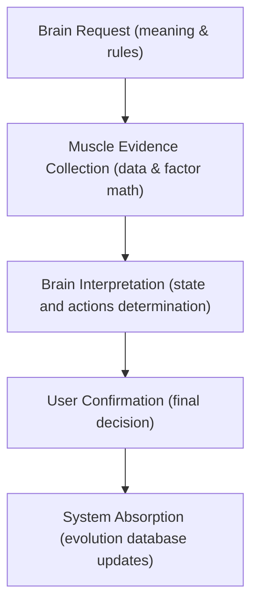

# Brain-Muscle Handshake Protocol

This protocol defines the absolute architectural boundary and data handshake mechanism between `investing-os` (the Brain) and `stock_team` (the Muscle) across all execution lifecycles of the quant trading assistant.

## The Core Directive
* **The Brain (`investing-os`)** owns all **Meaning, Rules, Permissions, Sizing Decisions, Thesis Adoptions, and Evolution Loops**. It defines "Why" a level or trade exists.
* **The Muscle (`stock_team`)** owns all **Fact Retrieval, Formula Calculations, Aggregate Compilations, Trade Evidence Exporters, and Backtest Engines**. It never makes recommendations.

---

## 1. Handshake Lifecycle Matrices

### 1.1 Pre-Market Plan
* **Brain Owns (`investing-os`)**: Strategic Stance, Thesis, Max Risk, Capital Limits, Target Allowed Tactics.
* **Muscle Owns (`stock_team`)**: Pre-market Index Quotes, Gap % Calculations, ATR, Sector/Peer RS metrics, Rule Collisions (Discipline Check).
* **Input Artifact**: `pre-market-decision-sheet.json` (Brain Input)
* **Output Packet**: `pre-market-packet.md` (Muscle Evidence Output)
* **Muscle Forbidden**: Generating target entries or recommended position sizing weights dynamically.

#### A. 立场全集 (role 或 stance)
大脑在决策单中给出的 stance，对于肌肉端来说，意味着资金占用和执行状态：

| 大脑 stance 值 | 肌肉端物理执行定义 | 肌肉端计算与风控行为 |
| :--- | :--- | :--- |
| `core` | 核心底仓 | 允许高仓位限额（如 Max 15%），使用宽幅 ATR 止损防止震仓，长期持有。 |
| `swing` | 波段战术仓 | 允许中等仓位（如 Max 5%），使用紧凑型移动止损保护利润，一旦论点失效立刻清仓。 |
| `watchlist_active` | 聚焦观察哨 | 允许分配“低负载盘中监控”，计算实时技术指标偏离，但不进行任何资金占用。 |
| `watchlist_passive` | 备选监控池 | 不参与盘中监控，只在盘前盘后做价格拉取，作为看板展示。 |
| `reduce_only` | 只减不增 | 锁定该标的，禁止任何买入加仓计算，盘中只监控离场点位（反抽卖出价格计算）。 |

#### B. 战术与规则全集 (allowed_tactics / entry_strategy)
大脑指定一种战术，对于肌肉端意味着加载特定的因子公式库：

| 大脑 战术/策略值 | 肌肉端映射的数学公式与因子组合 | 物理入场价/止损价计算方法 |
| :--- | :--- | :--- |
| `rs_pullback_rebound` | 强 RS 回调买入 | * 入场价：MA(Close, 20) (20日均线回踩) * 止损价：MA(Close, 20) - 1.5 * ATR(14) * 辅助因子：个股 5D 相对强度 > 0。 |
| `breakout_20d` | 20日唐奇安通道突破 | * 入场价：Max(High[t-20:t-1]) * 止损价：Min(Low[t-10:t-1]) (10日最低价止损)。 |
| `mean_reversion_oversold` | 均值回归超卖吸筹 | * 入场价：Computed_Entry_Base = 今日现价（当 RSI14_5m < 30 且偏离 VWAP < -2% 时） * 止损价：Computed_Entry_Base - 2.0 * ATR(14)。 |
| `hold_inactive` | 静默持有 | 不计算任何买入点，直接拉取 positions.json 中的硬止损作为保护线。 |

### 1.2 Intraday Monitor
* **Brain Owns (`investing-os`)**: Guidance state (Red/Green state), Allowed Actions, Risk Breaker Rules.
* **Muscle Owns (`stock_team`)**: IBKR Account Sync (Fills/Positions/Orders), VWAP calculated proximity alerts, Sector breakout status.
* **Input Artifact**: `intraday-guidance-state.json` (Brain input)
* **Output Packet**: `runtime-monitor-packet.md` or `intraday-evidence-packet.md` (Muscle Output)
* **Muscle Forbidden**: Recommending exits, defining intraday stops on its own, or initiating order executions.

### 1.3 Company & Industry Research
* **Brain Owns (`investing-os`)**: Fundamental Questions, Thesis Hypotheses, Moat definitions.
* **Muscle Owns (`stock_team`)**: Historical Price Retrieval, Quarterly/Annual Statement Compilations, Margin/Debt Ratio Math, Polygon News Cataloging.
* **Input Artifact**: `research-request.json`
* **Output Packet**: `company-research-packet.md` / `industry-research-packet.md`
* **Muscle Forbidden**: Adoption of final investment thesis or suggesting Buy/Sell/Hold rating.

### 1.4 Trade Review & Post-Market Review
* **Brain Owns (`investing-os`)**: Execution Compliance analysis, Cognitive Bias reviews, Evolution Rule updates.
* **Muscle Owns (`stock_team`)**: Order & Fill matching (Broker Feed), Execution minute price vs VWAP calculations, benchmark relative performance math.
* **Input Artifact**: `review-request.json`
* **Output Packet**: `contextual-trade-evidence-packet.md`
* **Muscle Forbidden**: Evaluating trader's psychological state or making final disciplinary grades.

---

## 2. Standard Handshake Flow

Every lifecycle module follows the exact same logical pipe:

